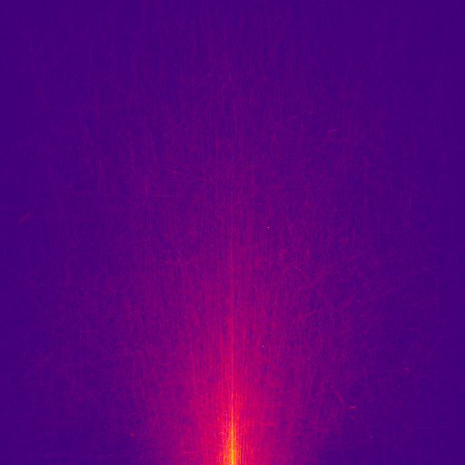

# Neutron

Neutron scattering physics simulation

<div align="center">
    
</div>

## Parameters

| Name         | Type       | Units        | Description                                                                     |
| ------------ | ---------- | ------------ | ------------------------------------------------------------------------------- |
| num_threads  | int        | --           | Target number of threads to use. Will not exceed number of physical cores.      |
| num_steps    | int        | --           | Number of uniformly spaced data dumps to make over total simulation.            |
| colour_map   | [string]   | --           | Uniformly spaced hex colour codes creating linear colour map for visualisation. |
| num_neutrons | int        | --           | Total number of Neutron lifetimes to make.                                      |
| block_size   | int        | --           | Number of Neutron lifetimes simulated in each threads processing chunk.         |
| bump_dist    | float      | Meter        | Distance to push Neutrons past grid boundaries when colliding with them.        |
| min_weight   | float      | --           | Minimum statistical weight Neutrons need to be simulated.                       |
| gun_pos      | [float; 3] | Meter        | Spawn location of Neutrons.                                                     |
| gun_target   | [float; 3] | Meter        | Fired upon position of new Neutrons.                                            |
| gun_spread   | float      | degree       | Unifrom random spread of Neutrons away from target vector.                      |
| scat_coeff   | float      | 1/Meter      | Scattering coefficient.                                                         |
| abs_coeff    | float      | Joules/Meter | Absorption coefficient.                                                         |
| mins         | [float; 3] | Meter        | Minimum geometric bound of the target material cube.                            |
| maxs         | [float; 3] | Meter        | Maximum geometric bound of the target material cube.                            |
| num_voxels   | [int; 3]   | --           | Number of partitions along each Cartesian axis.                                 |

## Installation

### Dependencies

-   [Rust](https://www.rust-lang.org/tools/install)

### Quickstart

Downloading the release tool should be as simple as:

```shell
cargo install neutrons
```

Create a directory called `input`, and within it add a parameters file called `parameters.json`:

```shell
mkdir input
touch input/parameters.json
```

The parameters file should look something like [this](./input/parameters.json).

You can then run the program with:

```shell
neutrons parameters.json
```
